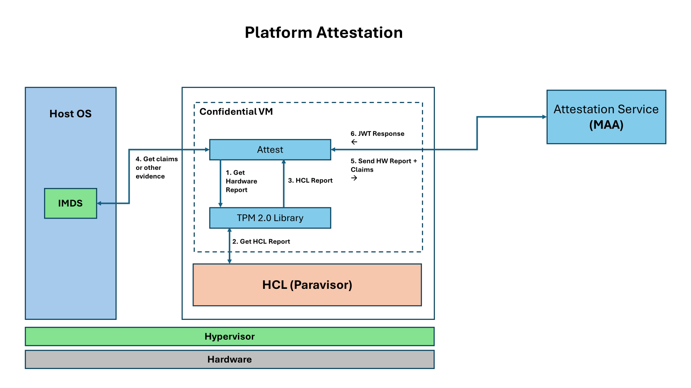

# Python Attestation Sample App
Remote Attestation empowers a `relying party`, whether it be the workload owner or the user, to authenticate that their workload is operating on a platform equipped with `Intel TDX` or `AMD SEV-SNP` technology before divulging sensitive information. In this instance, we undertake the assessment of the `Hardware Report's` integrity and trustworthiness through the services of an Attestation Provider. This application serves as an instructive demonstration highlighting the implementation of Remote Attestation using Python programming language.

## Tools
- [Attestation Tool](#attest)
- [Rading Hardware Report Tool](#read_report-only-snp)

## Overview



## Download Pre-built Executables

Pre-built standalone executables are available from the [GitHub Releases](https://github.com/Azure/cvm-attestation-tools/releases) page. No Python installation or dependencies required!

### Release Structure

Each release contains two platform-specific archives:

#### Windows Release (`attest-win.zip`)
```
attest-win/
├── attest.exe                    # Attestation CLI tool
├── read_report.exe               # Hardware report reader
├── config_snp.json              # SNP with MAA configuration
├── config_snp_guest.json        # SNP Guest attestation configuration
├── config_tdx.json              # TDX with MAA configuration
├── config_tdx_ita.json          # TDX with Intel Trust Authority configuration
└── config_tdx_guest.json        # TDX Guest attestation configuration
```

#### Linux Release (`attest-lin.tar.gz`)
```
attest-lin/
├── attest                       # Attestation CLI tool
├── read_report                  # Hardware report reader
├── config_snp.json              # SNP with MAA configuration
├── config_snp_guest.json        # SNP Guest attestation configuration
├── config_tdx.json              # TDX with MAA configuration
├── config_tdx_ita.json          # TDX with Intel Trust Authority configuration
└── config_tdx_guest.json        # TDX Guest attestation configuration
```

### Quick Start with Pre-built Executables

**Windows:**
1. Download `attest-win.zip` from the latest release
2. Extract the archive
3. Run from PowerShell or Command Prompt:
   ```powershell
   cd attest-win
   .\attest.exe --c config_tdx.json
   .\read_report.exe
   ```

**Linux:**
1. Download `attest-lin.tar.gz` from the latest release
2. Extract and run:
   ```bash
   tar -xzf attest-lin.tar.gz
   cd attest-lin
   sudo ./attest --c config_tdx.json
   sudo ./read_report
   ```

> **Note:** On Linux, you may need to make the executables runnable: `chmod +x attest read_report`

## Intall Dependencies and Build CLI Tool
Install all the dependencies and build the CLI tool called `attest`

### Linux
Install dependencies on Linux
``` bash
cd cvm-attestation-tools/cvm-attestation/
sudo ./install.sh
```

### Windows
Install dependencies on Windows
```
cd .\cvm-attestation-tools\cvm-attestation\
.\install.ps1
```

## Uninstall the `attest` CLI Tool
For uninstalling the cli tool run the following command:
```
pip3 uninstall attest -y
```

## Uninstall the `read_report` CLI Tool
For uninstalling the cli tool run the following command:
```
pip3 uninstall read_report -y
```

## attest
Tool to attest the CVM

### `--c` Config File Option
Option to set config file

#### Linux
Run `attest` on Linux
```
sudo attest  --c config_sample.json
```

#### Windows
Run `attest` on Windows
```
attest  --c config_sample.json
```

### `--t` Attestation Type Option
Option to provide type of attestation to be run

#### Platform
Attest the Hardware using the Machines Hardware Report
```
sudo attest  --c config_sample.json --t Platform
```

#### Guest
Attest the Hardware and the Guest measurements
```
sudo attest  --c config_sample.json --t Guest
```
> NOTE: Attesting the Guest is only supported in SEV-SNP CVM

### SNP (MAA Only)
```
sudo attest  --c config_snp.json
```

### Trusted Launch (MAA Only)
```
sudo attest  --c config_trusted_launch.json --t Guest
```
On any Azure VM running "Trusted Launch", this will generate a MAA attestation token.  There will be no platform evidence included -- even if running "Trusted Launch" on a "Confidential Virtual Machine".

### TDX with MAA
```
sudo attest  --c config_tdx.json
```

### TDX with Intel Trust Authority
```
sudo attest  --c config_tdx_ita.json
```
**IMPORTANT:** Don't forget to add the `api_key` to the config file.


The console output will contain the `Token` returned by the Attestation Provider as well as some of the claims parsed from the token.

### TDX 
#### Attesting with MAA
```
Attested Platform Successfully!!

Claims:
        TCB Status:  UpToDate
        TCB SVN:  02010600000000000000000000000000
        Attestation Type:  tdxvm

CVM Configuration:
        Console Enabled:  True
        Secure Boot Enabled:  True
        TPM Enabled:  True
        User Data:  67BE2D9DE456C30EBB165EE6F0A04684555C23068F63E973C7B1DCB4A25817D20000000000000000000000000000000000000000000000000000000000000000
        TPM Persisted:  False
```

#### Attesting with Intel Trust Authority
```
Attested Platform Successfully!!

Claims:
        TCB Status:  OK
        TEE Debuggable:  False
        Evidence Type:  TDX
```

### SEV-SNP
#### Attesting with MAA
```
Attested Platform Successfully!!

Claims:
        Attestation Type:  sevsnpvm
        Status:  azure-compliant-cvm
        Bootloader SVN:  3
        Guest SVN:  5
        Microcode SVN:  115

CVM Configuration:
        Console Enabled:  True
        Secure Boot Enabled:  True
        TPM Enabled:  True
        User Data:  00000000000000000000000000000000000000000000000000000000000000000000000000000000000000000000000000000000000000000000000000000000
```

## read_report (only SNP)
Tool to read the Attestation report from the hardware the CVM is running on.

### Linux
```
sudo read_report
```

### Windows
```
read_report
```

### Arguments
#### `--t` or `-type` Attestation Type (optional)
Option to provide type of attestation to be run.
```
sudo read_report  --t snp_report
```
> Default is to read the SNP report from AMD

#### `--o` or `-out` Output filename (optional)
The name of the output file to store the report
```
sudo read_report  --o my_report.bin
```
> The attestation report will stored in `report.bin` by default


### Output Sample
```
PS C:\Users\<USER>\cvm-attestation-tools\cvm-attestation> read_report
TSS.Py::__INIT__.PY invoked
2025-01-24 19:16:01,001 - read_report - INFO - Attestation started...
2025-01-24 19:16:01,001 - read_report - INFO - Report type selected: snp_report
2025-01-24 19:16:01,001 - handle_hardware_report - INFO - Reading hardware report: snp_report
2025-01-24 19:16:01,001 - get_hardware_report - INFO - Parsing hardware report...
2025-01-24 19:16:01,001 - get_hcl_report - INFO - Getting hcl report from vTPM...
2025-01-24 19:16:01,480 - get_hcl_report - INFO - Got HCL Report from vTPM!
2025-01-24 19:16:01,480 - log_snp_report - INFO - Attestation report size: 1184 bytes
2025-01-24 19:16:01,485 - log_snp_report - INFO - Report version: 2
2025-01-24 19:16:01,485 - log_snp_report - INFO - Report guest svn: 7
2025-01-24 19:16:01,485 - log_snp_report - INFO - Current TCB version: DB16000000000004
2025-01-24 19:16:01,485 - log_snp_report - INFO - Reported TCB version: D315000000000004
2025-01-24 19:16:01,485 - log_snp_report - INFO - Commited TCB version: D515000000000004
2025-01-24 19:16:01,485 - log_snp_report - INFO - Launched TCB version: D515000000000004
Attestation Report (1184 bytes):
Version:                      2
Guest SVN:                    7

Guest Policy (0x3001f):
    ABI Major:     0
    ABI Minor:     31
    SMT Allowed:   1
    Migrate MA:    0
    Debug Allowed: 0
    Single Socket: 0

Family ID:
01 00 00 00 00 00 00 00 00 00 00 00 00 00 00 00

Image ID:
02 00 00 00 00 00 00 00 00 00 00 00 00 00 00 00

VMPL:                         0
Signature Algorithm:          1

Current TCB: DB16000000000004
  Microcode:   219
  SNP:         22
  TEE:         0
  Boot Loader: 4

Platform Info (1):
  SMT Enabled:               1
  TSME Enabled:              0
  ECC Enabled:               0
  RAPL Disabled:             0
  Ciphertext Hiding Enabled: 0

Author Key Encryption:      False
Report Data:
b8 b7 da 92 ed bc 99 4d 7f 74 ff 48 db 49 df dd
12 67 1b df 2a 05 32 b1 b9 51 fb 0c c5 51 48 9e
00 00 00 00 00 00 00 00 00 00 00 00 00 00 00 00
00 00 00 00 00 00 00 00 00 00 00 00 00 00 00 00

Measurement:
03 6f c2 2b 51 79 81 a7 91 f7 f8 b8 9d 63 4a 00
e9 64 f6 b0 df ab c5 68 09 0e b4 39 3d 60 26 f9
6a a6 b7 cc a2 75 9f 29 e5 21 46 9f 11 89 c0 0c

Host Data:
00 00 00 00 00 00 00 00 00 00 00 00 00 00 00 00
00 00 00 00 00 00 00 00 00 00 00 00 00 00 00 00

ID Key Digest:
03 56 21 58 82 a8 25 27 9a 85 b3 00 b0 b7 42 93
1d 11 3b f7 e3 2d de 2e 50 ff de 7e c7 43 ca 49
1e cd d7 f3 36 dc 28 a6 e0 b2 bb 57 af 7a 44 a3

Report ID:
63 00 a3 76 fa 1d 09 85 a2 fc b5 29 68 ce 0a cc
16 bd b9 f2 4a be ab 60 e8 6e 9b 32 bb 34 72 84

Report ID Migration Agent:
ff ff ff ff ff ff ff ff ff ff ff ff ff ff ff ff
ff ff ff ff ff ff ff ff ff ff ff ff ff ff ff ff

Reported TCB:
TCB Version: D315000000000004
  Microcode:   211
  SNP:         21
  TEE:         0
  Boot Loader: 4

Chip ID:
84 c6 0b 7a f1 0d 80 24 a0 dc 25 13 9d bc a3 96
6f 65 c8 cf bc a7 d7 58 26 55 91 ba a5 6d 4a 9c
c6 5d 8e d2 d5 80 8b 3c c7 b6 3e 34 8b 5e 05 f2
22 40 a3 38 8b 54 49 fe ef 92 8e 12 c7 19 3e fe

Commited TCB: D515000000000004
  Microcode:   213
  SNP:         21
  TEE:         0
  Boot Loader: 4

Current Build:                20
Current Minor:                55
Current Major:                1
Committed Build:              17
Committed Minor:              55
Committed Major:              1

Launched TCB: D515000000000004
  Microcode:   213
  SNP:         21
  TEE:         0
  Boot Loader: 4

Signature:
  R Component:
f1 26 1a 5a ef b1 13 36 91 14 6b 3a 76 f5 c8 39
97 1b 1b b9 4a f3 df f0 d9 28 2f 39 e7 7d 31 36
da 74 be 85 ee d6 27 32 1d 6e 60 dd 37 b0 84 cd
00 00 00 00 00 00 00 00 00 00 00 00 00 00 00 00
00 00 00 00 00 00 00 00

  S Component:
dd dd cc 81 ea c7 d3 cc 45 1e 24 ad f2 01 07 36
eb 63 08 3a 29 6d 0d 04 99 03 8f b0 92 c2 47 71
2f ad 38 22 2b a4 4d b7 5c c3 4d 5e 92 49 9f d4
00 00 00 00 00 00 00 00 00 00 00 00 00 00 00 00
00 00 00 00 00 00 00 00
2025-01-24 19:16:01,594 - handle_hardware_report - INFO - Report saved to: report.bin
2025-01-24 19:16:01,594 - handle_hardware_report - INFO - Got attestation report successfully!
```